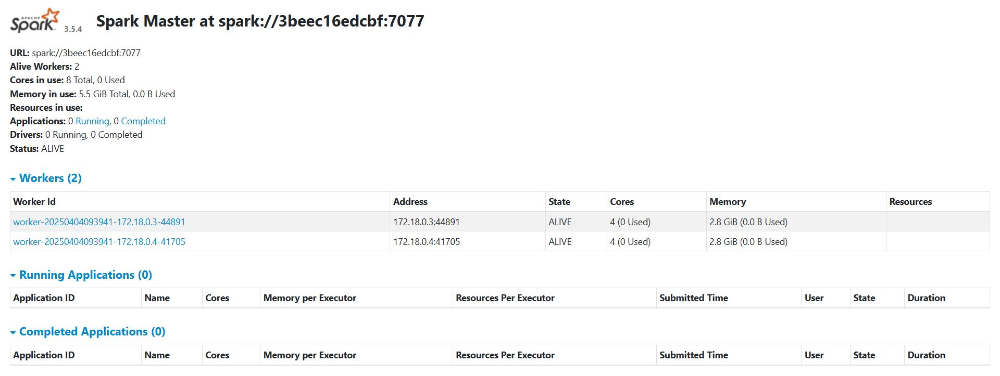

# 🚀 Cluster Spark avec Docker - TP Big Data

**Déploiement d'un environnement Spark complet pour le traitement batch et streaming**

## 📦 Contenu du dépôt

```

.
├── /batch-app/ # Application Java de calcul batch
│ ├── src/main/java/ # Code source (SimpleSumApp)
│ └── pom.xml # Configuration Maven
│
├── /streaming/ # Pipeline temps réel
│ ├── producer.py # Générateur de données
│ └── consumer.py # Calcul de carrés avec Spark Streaming
│
├── /docker/ # Configuration Docker
│ ├── spark-master/ # Dockerfile pour le nœud master
│ ├── spark-worker/ # Dockerfile pour les workers
│ └── docker-compose.yml # Orchestration (optionnel)
│
├── docs/ # Documentation complète
│ ├── rapport.pdf # Rapport technique LaTeX
│ └── screenshots/ # Captures d'interface
│
└── README.md # Ce fichier

```

## ✨ Fonctionnalités clés

- **Cluster Spark conteneurisé** : 1 Master + 2 Workers
- **Deux modes de traitement** :
  - 🔢 **Batch** : Calcul distribué de somme (1 à 100)
  - ⚡ **Streaming** : Calcul de carrés en temps réel
- **Monitoring intégré** : Interface web Spark sur `http://localhost:8080`

## 🛠️ Démarrage rapide

```bash
# 1. Lancer le cluster
docker network create spark-net
docker run -d --name spark-master --network spark-net -p 8080:8080 -p 7077:7077 spark-master-image
docker run -d --name spark-worker-1 --network spark-net spark-worker-image

# 2. Exécuter les applications
docker cp batch-app.jar spark-master:/app/
docker exec spark-master spark-submit --class SimpleSumApp /app/batch-app.jar
```

## 📊 Résultats attendus

  
_Exemple de sortie dans l'interface web_

## 📚 Documentation complète

Consultez le [rapport technique](docs/Rapport.pdf) pour :

- Les schémas d'architecture détaillés
- L'analyse des performances
- Les pistes d'optimisation

## 💡 Idées d'évolution

- Intégration avec Kafka
- Dashboard Grafana
- Tests de charge avec des jeux de données volumineux

---

🔧 **Contributions bienvenues** !  
📬 Contact : [ahmedbouba383@gmail.com](ahmedbouba383@gmail.com)
